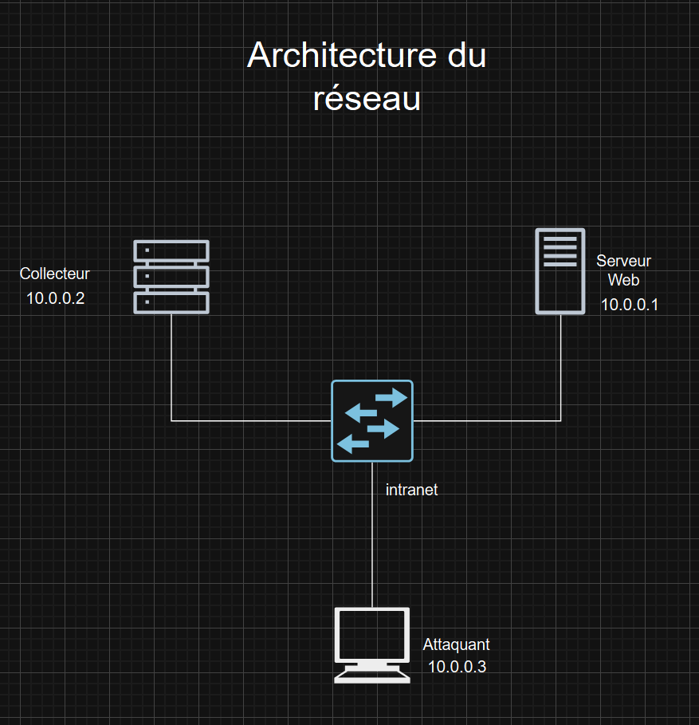

# AnomalyDetect

**UQAC-8INF857-TP1** : Système de détection d'anomalies et de gestion de logs pour la sécurité des réseaux

**Auteurs :**
- Martial Fousset  
- Joris Felzines  
- Elwin Bachelier  
- Alexandre Mucha

## Contexte du projet

L'objectif de ce projet est de créer un système de détection d'anomalies et de gestion de logs pour identifier les menaces potentielles et améliorer la sécurité des réseaux, dans le cadre du TP1 du cours de Sécurité Informatique 8INF857.

Pour ce faire, nous avons utilisé une combinaison d'outils ainsi qu'une simulation de divers scénarios d'attaque pour tester notre solution.

## Architecture

### Outils

Pour créer notre solution, nous avons combiné 4 outils avec chacun leur rôle bien défini :

- Snort en tant qu'IDS pour analyser le trafic réseau et faire remonter les alertes
- Syslog-ng pour collecter les logs sur les machines sous surveillance
- Elasticsearch en tant que base de données pour les logs
- Kibana pour la visualisation des logs et des alertes 

### Réseau 

On simule ici un réseau d'entreprise interne composé d'un serveur **Collecteur** sur lequel sera installé la solution, d'un **Serveur Web** offrant une application aux employés qui nous servira de victime pour notre test et enfin d'une machine **Attaquant** à partir de laquelle on lancera des attaques sur le serveur web.

Ce réseau sera simulé dans le logiciel de virtualisation **VirtualBox** (version 7.1.8) avec 3 machine virtuelles tournant sous **Debian** 1.13.0 AMD64. Sur les 3 VM, on fait l'ajout d’une carte réseau en réseau local sur le même switch virtuel avec **MODE PROMISCUITÉ**. Cela permettra aux machines d'interagir entre elles comme sur un réseau local.

Leurs addresses IP sont les suivantes : 
- Serveur Web : 10.0.0.1
- Collecteur : 10.0.0.2
- Attaquant : 10.0.0.3

## Installation

### VirtualBox 

Les détails de la configuration de VirtualBox sont disponibles dans le fichier [Documentation/ConfigurationVirtualBox.md](Documentation/ConfigurationVirtualBox.md).

### Collecteur 

Les détails de l'installation et de la configuration du Collecteur sont disponibles dans le fichier [Documentation/InstallationCollecteur.md](Documentation/InstallationCollecteur.md).

### Serveur Web 

Les détails de l'installation et de la configuration du Serveur Web sont disponibles dans le fichier [Documentation/InstallationServeurWeb.md](Documentation/InstallationServeurWeb.md).

### Attaquant

Les détails de l'installation et de la configuration de la machine Attaquant sont disponibles dans le fichier [Documentation/InstallationAttaquant.md](Documentation/InstallationAttaquant.md).

## Scénarios d'attaque

Un acteur malveillant est parvenu à déjouer la sécurité physique de l’entreprise et à se connecter sur le même réseau qu’une machine contenant un fichier critique pour l’organisation. Mais notre solution **AnomalyDetect** est également mise en place dans le réseau, et va nous permettre de visualiser les différentes phases d’attaque de cet acteur.

Pour les scénarios, nous avons choisi de mettre en place 5 attaques successives, imitant un cas réaliste et le cheminement logique d’un attaquant qui effectue une reconnaissance, obtient des informations, s'introduit dans le système, réussit à effectuer une élévation de privilège puis exfiltre des informations. Ces 5 différentes attaques seront décrites et justifiées notamment en utilisant la matrice ATT&CK du MITRE (https://attack.mitre.org/matrices/enterprise). 

**Attention** : les attaques 1,2 et 3 peuvent être effectuées indépendamment les unes des autres, mais les attaques 4 et 5 nécessitent d'avoir réussi l'attaque précédente pour être réalisables. En effet, l'attaque 4 nécessite d'avoir un accès shell sur le serveur web, et l'attaque 5 nécessite d'avoir des privilèges root sur le serveur web.

Après avoir configuré toutes les machines comme indiqué dans les fichiers d'installation, vérifiez que vous êtes en mode **root** sur la VM de l’attaquant (sur laquelle on restera pour effectuer toute la rotation d’attaque) avec `su -` et le mot de passe de la machine, puis que vous êtes placés dans le dossier /root. Nous sommes conscient que l'utilisation de root n'est pas une bonne pratique de sécurité dans le monde réel, mais cela simplifie beaucoup la réalisation des attaques dans le cadre de ce TP.

Le déroulement pas à pas des scénarios d'attaque est disponible dans le fichier [Documentation/ScenariosAttaque.md](Documentation/ScenariosAttaque.md).

## Analyse et conclusion

## Utilisation de l'IA générative
Production partagée avec l’IA générative pour la production de code : 

